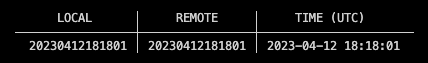

# The Big Reveal
****** Gonna add something soon ******

Production Domain: [thebigreveal.club](https://thebigreveal.club)

---
&nbsp;
## Environment Variables
If you haven't already, install [Vercel CLI](https://vercel.com/docs/cli).
```
npm i -g vercel
```

Once installed, you will need to authenticate yourself.
```
vercel login
```
Once complete you will be able to pull in the environment variables via vercel.
```
vercel env pull
```

---
&nbsp;
## Docker
Install Docker from this link: https://docs.docker.com/engine/install/

A really helpful video explaining a handful of docker related questions you may have. [Link](https://www.youtube.com/watch?v=pg19Z8LL06w) (For Docker beginners)

---
&nbsp;
## Supabase
### Initial setup
Before we can move forward, you must be invited to the Supabase project.

1. You will need to install the Supabase CLI from this link: https://supabase.com/docs/guides/cli

Once you have this installed, you will have to run the following
```
supabase login
```

2. Make sure your Docker is running and your Docker Dashboard is open before moving forward

3. Run the following commands
```
supabase start
```

Once complete, you should be able to validate if it all worked by going to http://localhost:54323. If you see an instance of a supabase dashboard Good! It will be empty, that is expected for now.

4. You must link your Supabase CLI with your Supabase's project

```
supabase link --project-ref weuircwaseaewsmvjnye
```

<!-- At this point you should still have an empty local database. We can fix this by pulling in the latest from the Supabase Repository. You can check and see if you are up to date by running (Make sure you have pulled in the latest from the development Github granch)
```
supabase migration list
```
You should see some values in the REMOTE column. Example bellow


5. New lets update your local environment by running the following
```
supabase db remote commit
```

Now if you run `supabase migration list` again, then you will see that your local will be up to date. Example bellow



6. Last but not least run the folowing to reset your local development environment
```
supabase db reset
``` -->

You should be done. You should now be able to see the tables and other such goods on your local environment!

&nbsp;
### Troubleshoot
If you are a mac user and getting this error when trying to start your Docker
```
supabase start
Error: Cannot connect to the Docker daemon at unix:///var/run/docker.sock. Is the docker daemon running?
in github.com/supabase/cli/internal/utils.AssertDockerIsRunning:48
in github.com/supabase/cli/internal/start.Run:33
Try rerunning the command with --debug to troubleshoot the error.
```

The solution is easy, open your `~/.zshrc` (Assuming you are using zsh!) file and add in the two lines (the first must be above the second). The first line may already be there, check first.

```
source /Users/eshlox/.docker/init-zsh.sh || true
```

```
export DOCKER_HOST=unix://"$HOME/.docker/run/docker.sock"
```

Remember to restart your shell to apply the new changes.

&nbsp;
### Migration
So you have made adjustments to your local development environment and you want to create a migration (Pushing changes up to Prod)?
Easy ... well easy enough. You first must create a new local schema file by running

```
supabase db diff --use-migra -f [schema file sufix]
```

This sufix can be anything as it is an identifyer you are giving it.

&nbsp;
### Github Actions
There are two Supabase Github actions implemented
- When the *develop* Github branch gets updated, it performs a migration to *The_Big_Reveal Dev*.
- When the *main* Github branch gets updated, it performs a migration to *The_Big_Reveal Prod*.

That said we should never never never update any of the databases directly. They should always be adjusted locally, migrated to a Github branch and then automatically updated via the Github actions.

&nbsp;
### TLDR

- `supabase start` --> Start Docker container
- `supabase stop` --> Stop Docker Container
- `supabase db remote commit` --> Pull the latest remote onto your local
- `supabase db reset` --> Clear your local environment's data and re-populate using the *seed.sql* (Dummy data). Basically restarting the container.
- `supabase db diff --use-migra -f [new schame name]` --> Generates a new schema file
- `supabase db push` --> Push up your local environment changes to the remote branch
- `supabase migration list` --> List out the remote and remote versions
- `supabase migration repair [version] --status reverted` --> Remove that remote version
- `supabase migration repair [version] --status applied` --> Insert that remote version

&nbsp;
### References
- [Supabase Local Development](https://supabase.com/docs/guides/cli/local-development)
- [Issue with MacOS Docker Start](https://eshlox.net/2023/02/26/supabase-cli-cannot-connect-to-the-docker-daemon/)
- [Supabase CLI](https://supabase.com/docs/reference/cli/start)

---
&nbsp;
## Package Scripts
There are descriptions of each scripts at the bottom of the `package.json` file. You can have a list of the available scripts show up on your terminal with their description by globally installing and using [ntl](https://www.npmjs.com/package/ntl). I personally recomend it.

Example of what this can look like


---
&nbsp;
## Node Version Manager
Version: v19.0.0

You can have your projects .nvmrc file automatically install or change. That way you won't have to make any adjustments to your node version when CD'ing into a project that contains a .nvmrc (Like this project for example).
All you must do is add this to your `bash_profile` or `.zshrc`.

``` Shell
# Changes node version depending on the project
autoload -U add-zsh-hook
load-nvmrc() {
  local node_version="$(nvm version)"
  local nvmrc_path="$(nvm_find_nvmrc)"

  if [ -n "$nvmrc_path" ]; then
    local nvmrc_node_version=$(nvm version "$(cat "${nvmrc_path}")")

    if [ "$nvmrc_node_version" = "N/A" ]; then
      nvm install
    elif [ "$nvmrc_node_version" != "$node_version" ]; then
      nvm use
    fi
  elif [ "$node_version" != "$(nvm version default)" ]; then
    echo "Reverting to nvm default version"
    nvm use default
  fi
}
```

---
&nbsp;
## Patterns and Structure
We are using the Container Pattern combined with other Patterns types.
Essentially, the folder structures are comprised of 3 major file types, `container`, `styled` and `jsx`.

For example, here is the folder structure for the Header.
```
scr/components/header

  ├── index.ts                    export { default } from './Header.container'
  ├── Header.component.tsx        Handles all of the logic
  ├── Header.tsx                  Takes in props and renders the JSX (No logic)
  ├── Header.styled.tsx           Where all of the Styled Component are stored and managed
  └── Header.type.ts              Used to store types (Only used if there are many)
  ```

---
&nbsp;
## Comments
In this project, there are two types of comments, `//` and `/* */`.
They each have their utilities and meaning.

`//`: Temporary comment, meant to be removed at some point. In most cases, they should not survive the PR/MR stage.

`/* */`: These are permanant. Designed to provide information.

---
&nbsp;
## Github Branch Structure
~~We are using [Gitflow](https://www.atlassian.com/git/tutorials/comparing-workflows/gitflow-workflow) as our workflow.~~

~~If you are using a Git GUI like me (GitKraken), you may want to look into how to perform the workflow on it. GitKraken has a Gitflow integration that makes it very easy to create, manage and delete branches. I assume other Git GUI also have such intergration.~~

Although Gitflow is an accepted standard, it removes the use of Pull Requests imbetween stable branches. There are ways around this, however, it requires to step outside of the Gitflow convention. For that reason, we are moving away from it and jumping into the good old fasion, `main` - `staging` - `develop` branche architecture. Well, kinda. Considering this is a small scale project and there aren't many developers working on it, we will skip out on the Staging environment.

---
&nbsp;
## NewComponentTemplate ... whats this?
This is a folder you can find at the root level of this project. It is used as a new component template (its in its name). Idealy when creating a new component, you can simply copy the files within it and past it inside your new component directory. Then you just have to change every instamce of `NewComponentTemplate` with the name of the component.

---
&nbsp;
## Trello
We have a, ask for an invite and jump in, assign yourself to a task and walk it through to victory (Done & Live).

---
&nbsp;
## Are we missing anything?
If you see anything we aree missing that could be of value to integrate, please let us know! Lets have a discusion around it!

If you see anything you don't like in terms of ... well any thing, bring it up. Who knows we may change it for the better of our project.

---
&nbsp;
## Have fun!
The ultimate purpose of this project is to learn, share and have fun!

&nbsp;

&nbsp;
# For Developers
This section is for the developers to drop some helpful information

---
&nbsp;
## SQL Queries Constraints

---
&nbsp;
### Display list of all check constraints
To list out every `c` (check) constraints on all tables, drop the following in your Supabase `SQL Editor`.
``` SQL
select pgc.conname as constraint_name,
  ccu.table_schema as table_schema,
  ccu.table_name,
  ccu.column_name,
  pg_get_constraintdef(pgc.oid) 
from pg_constraint pgc
  join pg_namespace nsp on nsp.oid = pgc.connamespace
  join pg_class  cls on pgc.conrelid = cls.oid
  left join information_schema.constraint_column_usage ccu
    on pgc.conname = ccu.constraint_name
    and nsp.nspname = ccu.constraint_schema
where contype ='c'
order by ccu.table_name;
```

---
&nbsp;
### Create a new check constraint
If you want to add one. Here is an example
``` SQL
alter table public.profiles
  add constraint full_name_formating 
  check (full_name ~* '^[A-Za-z\s]*$');
```
To create multiple conditions for one check constraint refer to this example
``` SQL
alter table public.profiles
  add constraint username_length
  check ((char_length(username) >= 3 ) and (char_length(username) < 100));
```

`public.profiles` being the name of the table

`full_name_formating` & `username_length` being the name of the check contstraint

---
&nbsp;
### Remove check constraint
Here is how you can remove a paticular check constraint. Here is an example
``` SQL
alter table public.profiles
  drop constraint full_name_length
```
`public.profiles` being the name of the table

`full_name_length` being the name of the constraint

---
&nbsp;
### Update check constraint
Here is how you can update a paticular check constraint. Here is an example
``` SQL
alter table public.profiles
  drop constraint full_name_length
, add  constraint full_name_length CHECK (char_length(full_name) < 100);
```
`public.profiles` being the name of the table

`full_name_length` being the name of the constraint